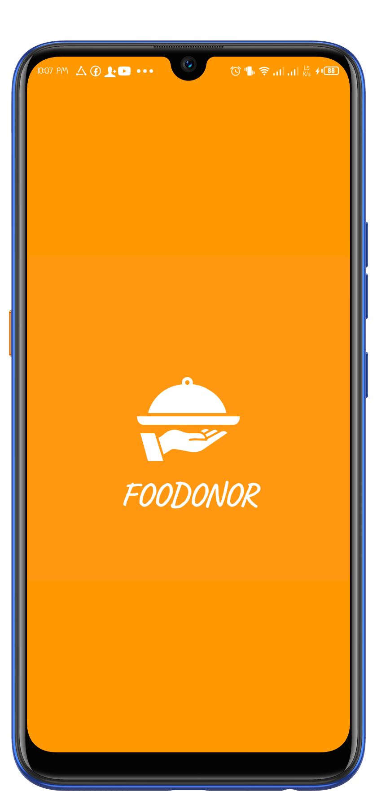
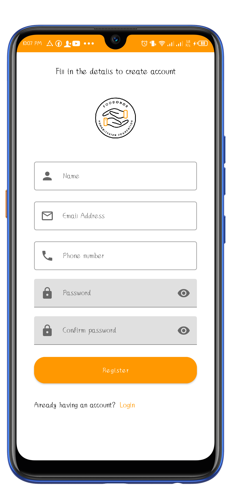
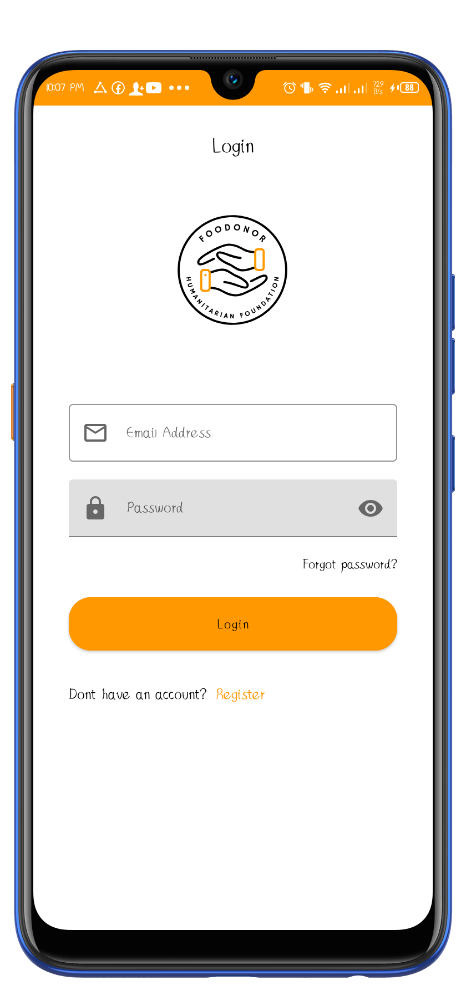
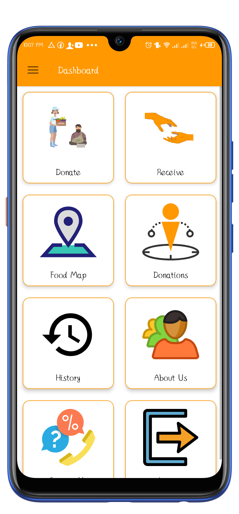
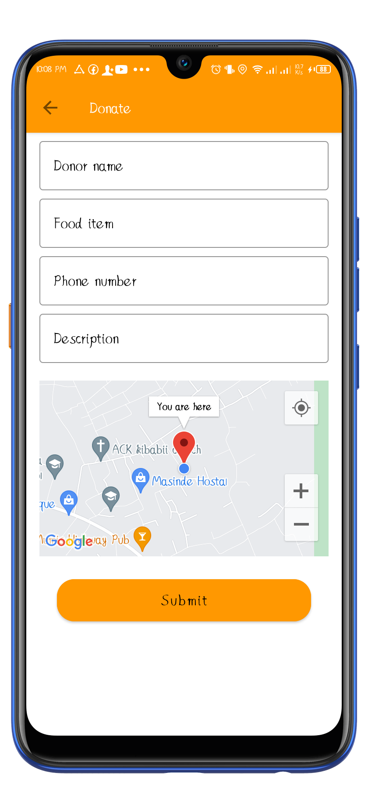
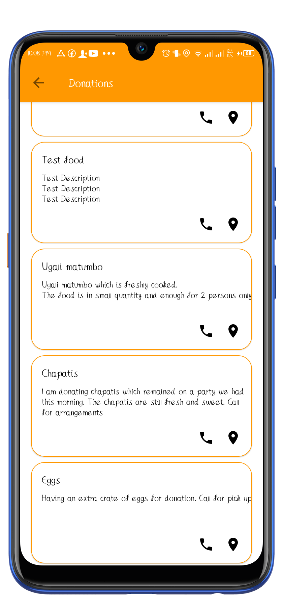
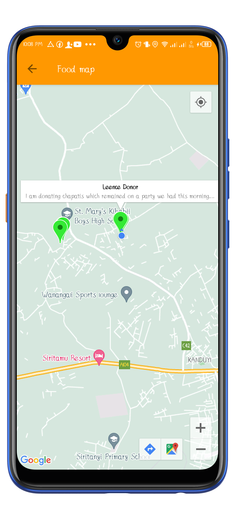

# FOODONOR
This is a food donation android application designed to reduce food wastage by donating excess food to poor or needy people.  Based on Kotlin and currently under development.

In Africa, especially Kenya, food wastage is a disturbing issue. The streets, garbage bins and landfills have ample proof to prove it. Homes, canteens, restaurants, social and family get-togethers and functions disposes out so much food.
Food wastage is not only an indication of hunger or pollution, but also economic problem. The high standard of living has resulted in the wastage of food, clothes, etc, because of quick changes in habits and lifestyle. Instead of wasting these things we can put them in use by donating them to various organizations such as orphanages, old age homes, etc. The product is an internet-based android application that basically aims at charity through making donations on excess food that may go to waste.
This application is meant to reduce food wastage and also fulfill other requirements like clothes, books, utensils, etc. for the needy organizations and people.

Instead of throwing away the same as trash (which usually is the scenario), it can be used to feed the homeless. Also, since the pickup is arranged for by the enterprise, the restaurants/cafes need not worry about it. Benefiters will be both the restaurants/cafés (reducing the carbon footprint and wastage), and the needy.
The ultimate objective of this project is to communicate that investments in food wastage reduction is the most logical step in the pursuit of sustainable production and consumption, including food security, climate change and other adverse environmental effects. Public awareness materials and a strategy will be developed to this effect.

# Technologies
- [Firebase Firestore](https://firebase.google.com/docs/firestore) - Cloud Firestore is a flexible, scalable database for mobile, web, and server development from Firebase and Google Cloud. 
- [Kotlin](https://developer.android.com/kotlin) - Kotlin is a programming language that can run on JVM. Google has announced Kotlin as one of its officially supported programming languages in Android Studio; and the Android community is migrating at a pace from Java to Kotlin
- [Navigation Components](https://developer.android.com/guide/navigation/navigation-getting-started) -  Helps you implement navigation, from simple button clicks to more complex patterns, such as app bars and the navigation drawer.
- [Viewmodel](https://developer.android.com/topic/libraries/architecture/viewmodel) -The ViewModel class is designed to store and manage UI-related data in a lifecycle conscious way
- [LiveData](https://developer.android.com/topic/libraries/architecture/livedata) -  A lifecycle-aware data holder with the observer pattern
- [Kotlin Coroutines](https://developer.android.com/kotlin/coroutines) - A concurrency design pattern that you can use on Android to simplify code that executes asynchronously
- [Hilt-Dagger](https://developer.android.com/training/dependency-injection/hilt-android) - Hilt is a dependency injection library for Android that reduces the boilerplate of doing manual dependency injection in your project. Doing manual dependency injection requires you to construct every class and its dependencies by hand, and to use containers to reuse and manage dependencies.
- [MVVM](https://www.geeksforgeeks.org/mvvm-model-view-viewmodel-architecture-pattern-in-android/) - MVVM stands for Model, View, ViewModel. Model: This holds the data of the application. It cannot directly talk to the View. Generally, it's recommended to expose the data to the ViewModel through Observables.
- [Maps SDK for Android](https://developers.google.com/maps/documentation/android-sdk/start) - With the Maps SDK for Android, add maps to your Android app including Wear OS apps using Google Maps data, map displays, and map gesture responses. You can also provide additional information for map locations and support user interaction by adding markers, polygons, and overlays to your map.\

# Screenshots
 
 ## Splash screen
 
 

  

  
 ## Sign in screen
 
 

  

  
 ## Foodonor 
 
 

  

  
  ## Support
  
- Found this project useful ❤️? Support by clicking the ⭐️ button on the upper right of this page. ✌
- Feel free to contribute in any way to the project from typos in docs to code review are all welcome.
